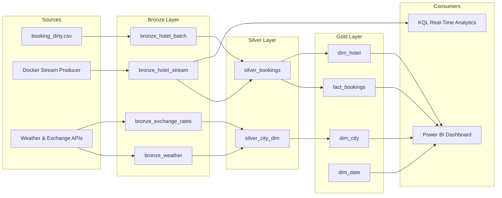

# 🏨 HappyBooking — Modern Data Engineering Platform

**Microsoft Fabric | Docker | PySpark | dbt | Great Expectations**

End-to-end Lakehouse data platform processing 1.7M+ hotel booking records through **Bronze → Silver → Gold** medallion architecture.

---

## 🏗️ Architecture



## 📁 Project Structure

```
HappyBooking/
├── data/                    # Raw data files
│   ├── hotel_raw_batch.csv  # 70% of booking data (batch)
│   └── hotel_raw_stream.csv # 30% of booking data (stream)
├── docker/                  # Stream simulator
│   ├── Dockerfile
│   └── stream_producer.py   # Event Hub producer
├── notebooks/               # Fabric PySpark notebooks
│   ├── 01_bronze_ingest_batch.ipynb
│   ├── 04_bronze_ingest_api.ipynb
│   ├── 05_silver_transformations.ipynb
│   ├── 06_quality_tests_ge.ipynb
│   └── 07_silver_dim_enrichment.ipynb
├── dbt_project/             # Gold layer models
│   ├── models/gold/
│   │   ├── fact_bookings.sql
│   │   ├── dim_city.sql
│   │   ├── dim_hotel.sql
│   │   └── dim_date.sql
│   └── dbt_project.yml
├── pipelines/               # Orchestration definitions
├── tests/                   # Unit & integration tests
├── .github/workflows/       # CI/CD
└── docs/                    # Documentation
```

## 🚀 Pipeline Execution Order

| Order | Notebook | Input | Output |
|-------|----------|-------|--------|
| 1 | `01_bronze_ingest_batch` | CSV file | `bronze_hotel_batch` |
| 2 | Docker + Eventstream | Stream JSON | `bronze_hotel_stream` |
| 3 | `05_silver_transformations` | Bronze tables | `silver_bookings` (1.7M rows) |
| 4 | `04_bronze_ingest_api` | city_clean list | `bronze_weather`, `bronze_exchange_rates` |
| 5 | `07_silver_dim_enrichment` | Weather + Rates | `silver_city_dim` |
| 6 | `06_quality_tests_ge` | Silver tables | Quality report |
| 7 | dbt Gold models | Silver tables | `fact_bookings`, `dim_*` |

## 🔧 Setup

### Prerequisites
- Microsoft Fabric workspace with Lakehouse
- Docker Desktop
- Python 3.11+

### 1. Start Stream Producer
```bash
cd docker
docker build -t stream-producer .
docker run -v "${PWD}/../data:/app/data" stream-producer
```

### 2. Run Notebooks in Fabric
Upload notebooks to Fabric workspace and run in the order above.

### 3. Run Tests
```bash
pip install pytest
pytest tests/ -v
```

## 📊 Gold Layer Star Schema

| Table | Type | Description |
|-------|------|-------------|
| `fact_bookings` | Fact | Bookings with EUR conversion, KPIs |
| `dim_city` | Dimension | City/Country + weather + exchange rates |
| `dim_hotel` | Dimension | Hotel attributes + tier classification |
| `dim_date` | Dimension | Calendar for Time Intelligence |

### Key KPIs
- **total_amount_eur** = `total_amount × exchange_rate_to_eur`
- **avg_nightly_rate** = `total_amount / nights`
- **hotel_tier** = Premium (4-5★) / Standard (3★) / Budget (1-2★)

## 🧪 Data Quality

Tested with **Great Expectations** + **PySpark native checks**:
- ✅ No NULL booking_id
- ✅ No duplicate bookings
- ✅ No negative prices
- ✅ Valid currency codes only
- ✅ Temperature in valid range (-60°C to +60°C)
